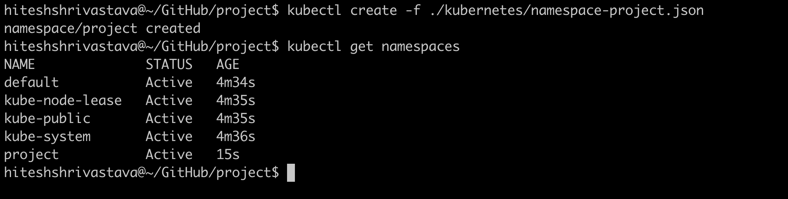
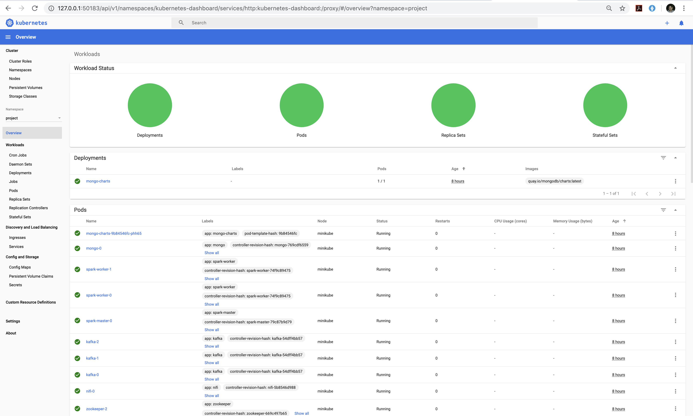

# Real Time Data Processing using Nifi/Kafka/Spark on Kubernetes

This is a demo project to demonstrate real time data processing service using a cluster of machines. In this use nifi ingest twitter feed from tweeter developer api and publish it to Kafka topic. Pyspark consume this kafka topic message and perform some transformations like counting the words in a tweet and also storing the messages to a mongodb database. 

MongoDb-Charts can be used to build some nice visualizaitons and do analysis on mongodb databases. Examples which I worked on:
- Extracting the hashtags from tweets and make a work cloud with trending hashtags in real time.
- Graphs to build popularity of certain brands, products or people.

## Getting Started

### Installing

#### 1. Start Minikube

```
minikube config set memory 10240
minikube start
```


#### 2. Set-up Namespace

```
kubectl create namespace project
```



#### 3. Set-up Zookeeper

```
kubectl create -n project -f ./kubernetes/zookeeper.yaml
```


#### 4. Set-up Nifi

```
kubectl create -n project -f ./kubernetes/nifi.yaml
```


#### 5. Set-up Kafka

```
kubectl create -n project -f ./kubernetes/kafka.yaml
```


#### 6. Set-up Spark

```
kubectl create -n project -f ./kubernetes/spark-master.yaml
kubectl create -n project -f ./kubernetes/spark-worker.yaml
```


Install required python packages for Pyspark
```
kubectl exec -it spark-master-0 -n project -- pip install pymongo
kubectl exec -it spark-worker-0 -n project -- pip install pymongo
kubectl exec -it spark-worker-1 -n project -- pip install pymongo
kubectl exec -it spark-master-0 -n project -- pip install textblob
kubectl exec -it spark-worker-0 -n project -- pip install textblob
kubectl exec -it spark-worker-1 -n project -- pip install textblob
```

#### 7. Set-up MongoDB

```
kubectl create -n project -f ./kubernetes/mongodb.yaml
```


#### 8. Set-up MongoDB Charts

```
kubectl create -n project -f ./kubernetes/mongodb-charts.yaml
```


### Verification

To verify is all services are up and running

```
kubectl get -n project all
```


```
minikube dashboard
```





### Execution

#### Import NiFi Template 

On Nifi canvas click upload template and browse for below template xml
* [Template](nifi-templates/twitter_analysis_process_group_demo.xml) - twitter_analysis_process_group_demo.xml


Setup Twitter API Secrets/Token properties


#### Start the Nifi Flow Process Group
#### Start Spark with below command
```
spark-submit --packages org.apache.spark:spark-streaming-kafka-0-8_2.11:2.4.4 --master spark://192.168.64.9:30191 pyspark/tweet_sentiment_analysis.py zookeeper-headless.project.svc.cluster.local:2181 tweets_demo_1
```

### Sample Use Cases


#### Trending Tweets


#### Tweets per location


#### Tweets Sentiment Analysis


